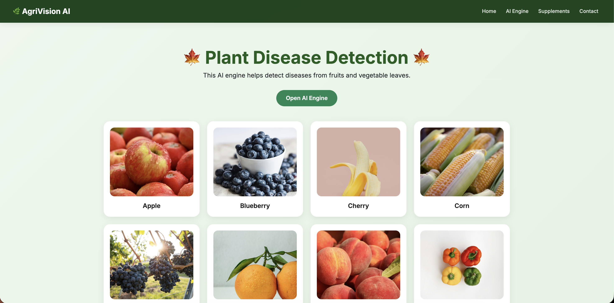
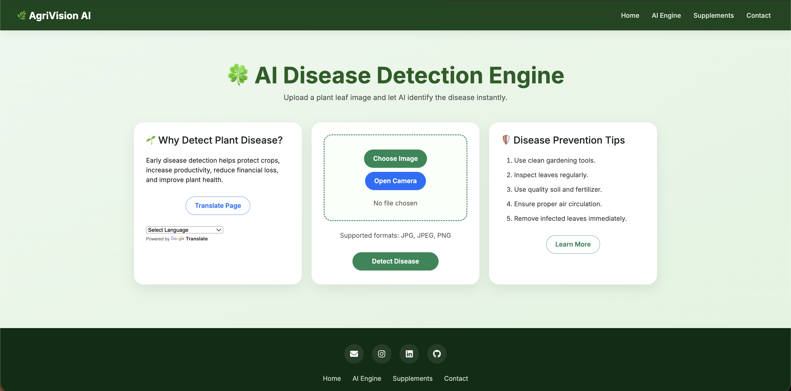
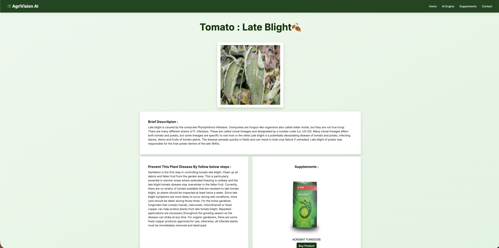
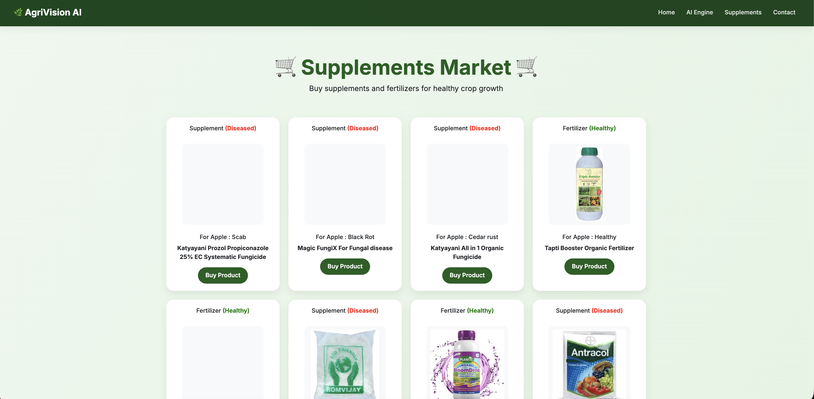
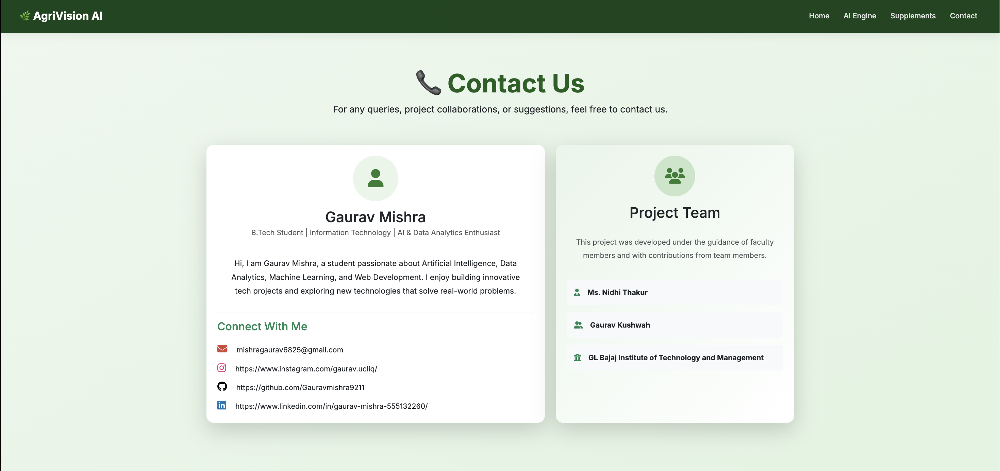

# 🌿 AgriVision AI

### 🚀 AI-Powered Leaf Disease Detection System

<p align="center">
  
</p>

<p align="center">
  
  
  
  
  
</p>

---

## 🌱 About the Project

AgriVision AI is a **Deep Learning-based web application** that detects plant leaf diseases and provides **smart recommendations** to improve crop health.

✔️ Built for farmers, students, and researchers
✔️ Fast, accurate, and easy to use
✔️ Real-time disease prediction

---

## 📸 Screenshots

### 🏠 Home Page



### 🤖 AI Engine



### 🌱 Disease Result



### 🛒 Supplements Market



### 📞 Contact Page



---

## 🚀 Features

* Upload plant leaf images
* Detect diseases using CNN model
* Instant AI predictions
* Disease description & prevention
* Fertilizer & supplement suggestions
* Camera capture support
* Responsive UI

---

## 🧠 How It Works

Leaf Image → Preprocessing → CNN Model → Prediction → Result + Recommendations

---

## 🛠️ Tech Stack

* **Backend:** Python, Flask
* **AI Model:** PyTorch
* **Frontend:** HTML, CSS, Bootstrap, JavaScript
* **Libraries:** NumPy, Pandas, Pillow

---

## 📂 Project Structure

leaf-health-detector/
│
├── app.py
├── CNN.py
├── disease_info.csv
├── supplement_info.csv
├── requirements.txt
├── Procfile
├── runtime.txt
│
├── static/
├── templates/
└── README.md

---

## ⚙️ Installation

```bash
git clone https://github.com/GauravMishra9211/leaf-health-detector.git
cd leaf-health-detector

python3 -m venv venv
source venv/bin/activate

pip install -r requirements.txt
python3 app.py
```

👉 Open in browser:
http://127.0.0.1:5000

---

## 🌱 Model Setup

⚠️ Model file is large and not included in repo

Place in root directory:

```bash
plant_disease_model_1_latest.pt
```

---

## 🌍 Deployment

Supported platforms:

* Render
* Railway
* Replit

Config:

```bash
Build: pip install -r requirements.txt  
Start: gunicorn app:app  
```

---

## 🎯 Objective

* Detect plant diseases accurately
* Provide actionable insights
* Help farmers using AI
* Improve agricultural productivity

---

## 🚀 Future Scope

* 📱 Mobile App
* 🌍 Multi-language support
* 📊 Larger dataset
* 📡 Real-time detection

---

## 👨‍💻 Author

**Gaurav Mishra**
B.Tech | AI & Data Analytics

📧 [mishragaurav6825@gmail.com](mailto:mishragaurav6825@gmail.com)
🔗 https://github.com/GauravMishra9211

---

## ⭐ Support

If you like this project:

👉 Star ⭐ the repo
👉 Share it
👉 Fork it

---

## 📜 License

Educational and research purposes only

---

<p align="center">
  
</p>

---

## ⚠️ IMPORTANT (DO THIS)

Create this folder:

```
/screenshots/
```

Add your images:

```
home.png
ai-engine.png
result.png
market.png
contact.png
```

Then push:

```bash
git add .
git commit -m "Updated README"
git push
```
